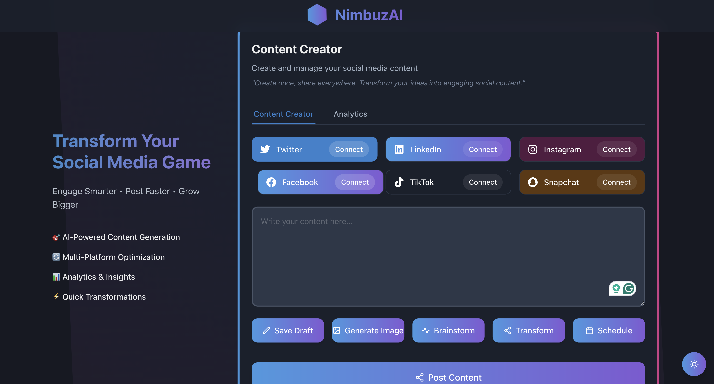
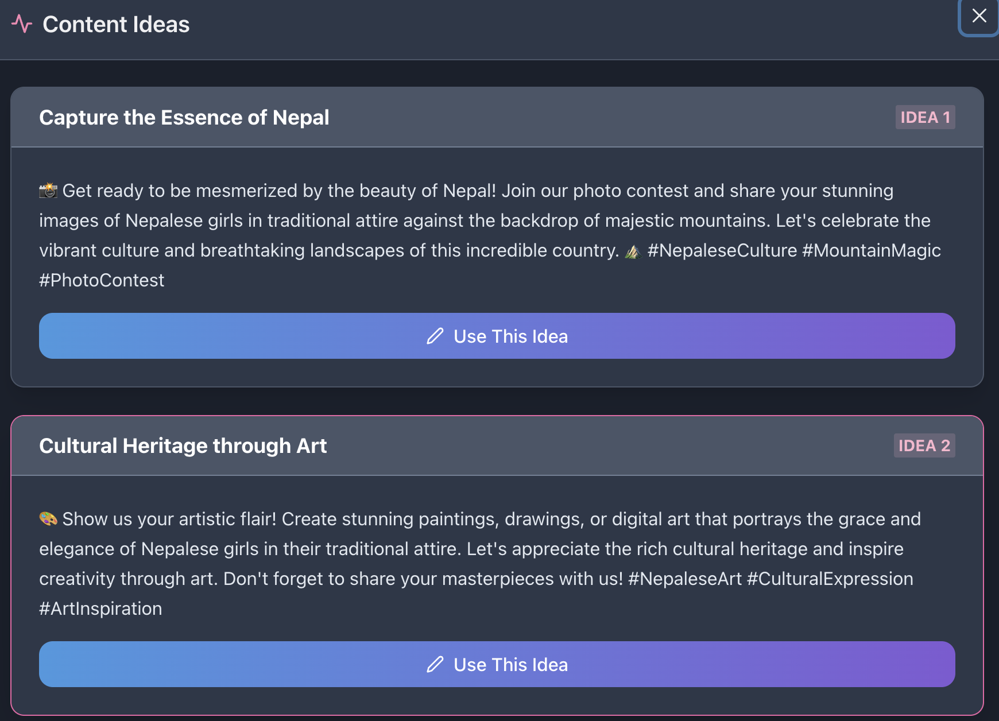
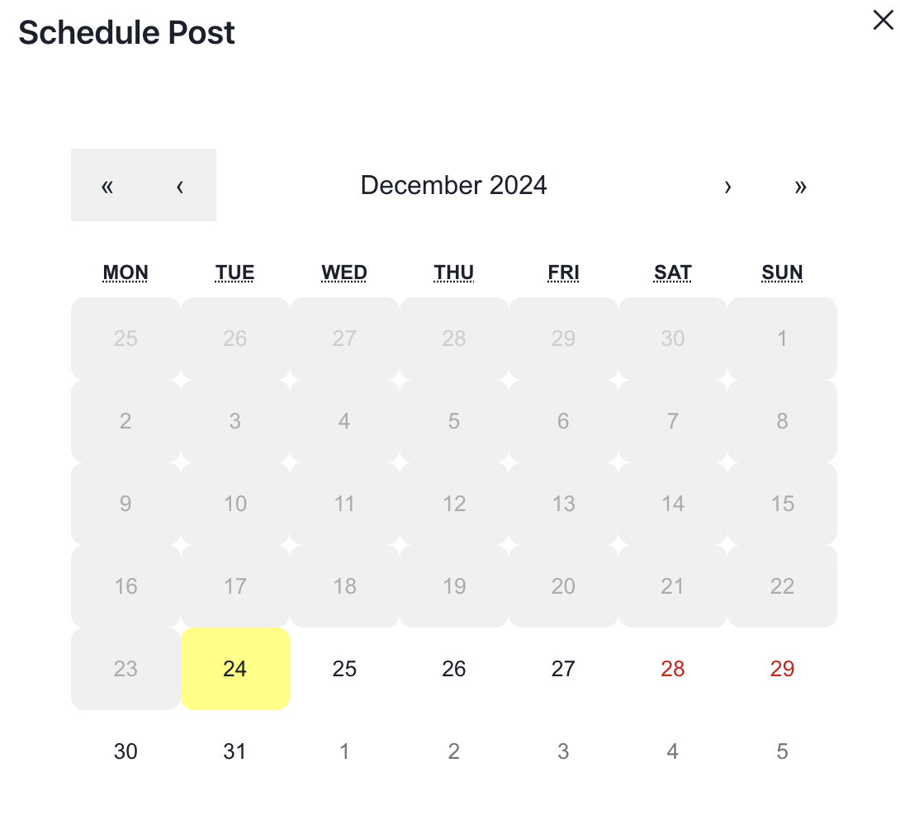
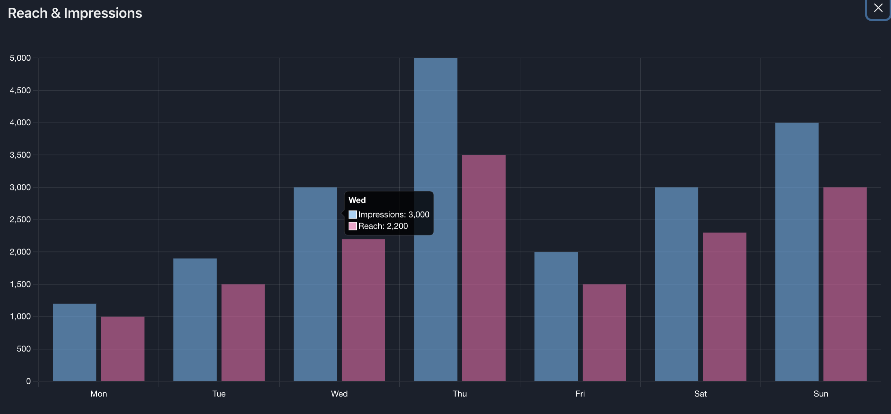
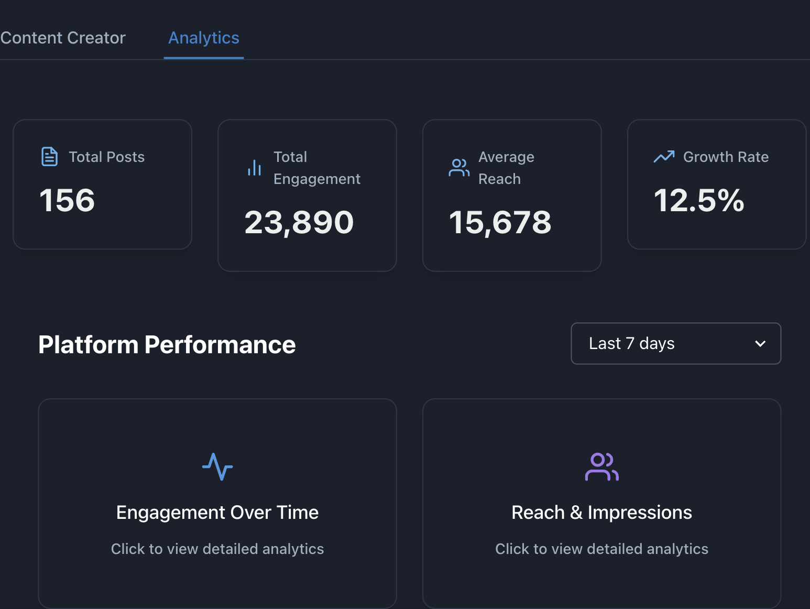
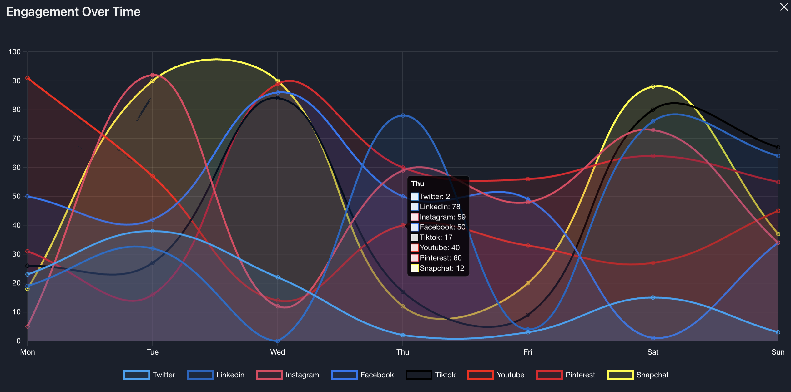

# 🚀 **NimbuzAI - AI-Driven Social Media Content Generator**

<p align="center">
  
</p>

### Transforming ideas into **platform-optimized**, **engaging content** with AI. From **analytics** to **creative generation**, manage your social media effortlessly. 🌐✨

---

## ✨ **Features at a Glance**

### 🎯 **Multi-Platform Support**
- 🐦 **Twitter/X**: Concise tweets with optimal hashtags.
- 💼 **LinkedIn**: Professional posts tailored to industries.
- 📸 **Instagram**: Visually compelling captions with trending hashtags.
- 🎥 **TikTok**: Trendy, viral-ready content ideas.
- 📘 **Facebook**: Conversational posts for maximum engagement.
- 👻 **Snapchat**: Youthful, snappy, and creative posts.

### 🤖 **AI-Powered Content**
- **Content Adaptation**: Tailored for each platform.
- **Tone Customization**: Choose professional, casual, or trendy.
- **Hashtag Optimization**: Boost discoverability.
- **Character Limit Management**: Perfect for all platforms.
- **Engagement Boost**: Maximize reach and visibility.

### 🎤 **Flexible Input Options**
- **Text Input**: Start with ideas in writing.
- 🎙️ **Voice-to-Text**: Seamless dictation.
- 📄 **File Uploads**: Transform images, videos, or documents into posts.
- 🖹 **PDF Extraction**: Extract key insights from PDFs.

### 📊 **Powerful Analytics**
- **Post Performance**: Track likes, shares, and comments.
- **Engagement Insights**: Understand your audience.
- **Follower Growth**: Monitor trends.
- **Platform Recommendations**: Boost impact with actionable tips.

### 🖼️ **AI-Generated Visuals**
- **Custom Graphics**: Tailored for Instagram, TikTok, and more.
- **Optimized Media**: Ready for every platform’s format.

---

## 🖼️ **Interface Highlights**

| **Overview**            | **Brainstorm**         | **Visual Generation**   |
|--------------------------|------------------------|--------------------------|
|  |  |  |

| **Transform**            | **Schedule Posts**     | **Maximize Reach**       |
|--------------------------|------------------------|--------------------------|
|  |  |  |

| **Track Analytics**      | **Engage Audience**    | **Upload Content**       |
|--------------------------|------------------------|--------------------------|
|  |  |  |

---

## 🛠️ **Tech Stack**

### **Frontend**
- ⚛️ **Next.js**: Scalable, server-rendered applications.
- 🎨 **Chakra UI**: Modern, responsive designs.
- 🛠️ **TypeScript**: Type-safe and scalable.
- 🗣️ **React Speech Recognition**: Enables voice input.

### **Backend**
- 🚀 **Node.js**: High-performance runtime.
- 🗄️ **PostgreSQL**: Secure relational database.
- 🔒 **OAuth2**: Authentication made easy.
- 🤖 **Google AI (Gemini)**: Cutting-edge AI for content.

---

## 🚀 **Getting Started**

### **Prerequisites**
- 🛠️ **Node.js** (v16+)
- 📦 **npm** or **yarn**
- 🗄️ **PostgreSQL**

### **Installation**
1. Clone the repo:
   ```bash
   git clone https://github.com/abhiishek340/NimbuzAi.git
   cd NimbuzAi
   ```
2. Install dependencies:
   ```bash
   npm install
   # Or use yarn
   yarn install
   ```
3. Set up environment variables:
   - Add credentials in `.env`.

4. Run the development server:
   ```bash
   npm run dev
   # Or yarn
   yarn dev
   ```
5. Open your browser: [http://localhost:3000](http://localhost:3000)

---

## 🧪 **Testing**
Run tests:
```bash
npm test
# Or yarn
yarn test
```

---

## 🤝 **Contribute**
- Fork the repo.
- Create a branch:
  ```bash
  git checkout -b feature/YourFeatureName
  ```
- Commit changes:
  ```bash
  git commit -m "Add YourFeatureName"
  ```
- Push your branch:
  ```bash
  git push origin feature/YourFeatureName
  ```
- Open a pull request.

---

## 📄 **License**
Licensed under the **MIT License**. See [LICENSE](LICENSE) for details.

---

## 🌟 **Acknowledgments**
- **OpenAI**: AI-driven inspiration.
- **Google AI (Gemini)**: Transforming creativity.
- **Community**: For invaluable tools and libraries.
