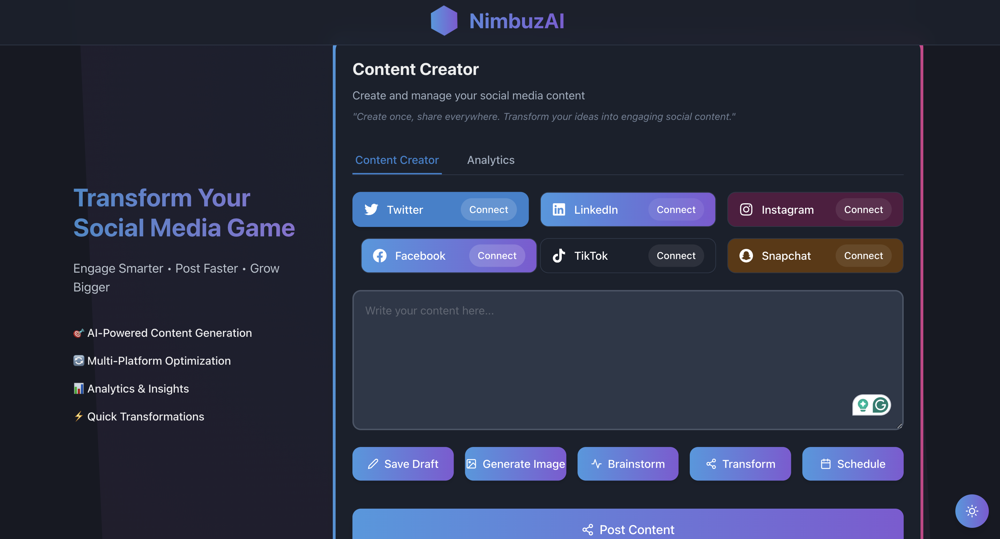
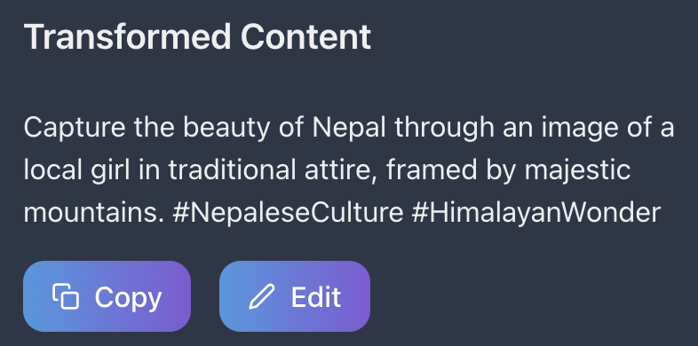
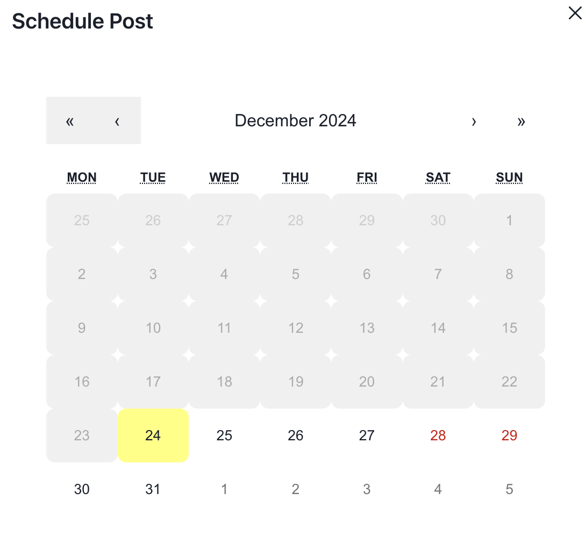
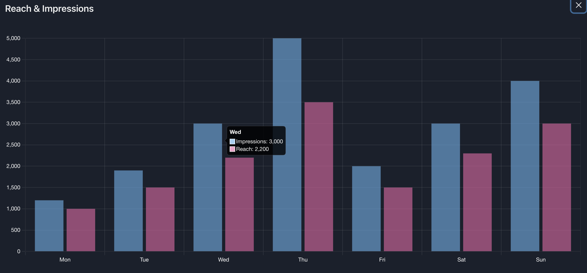
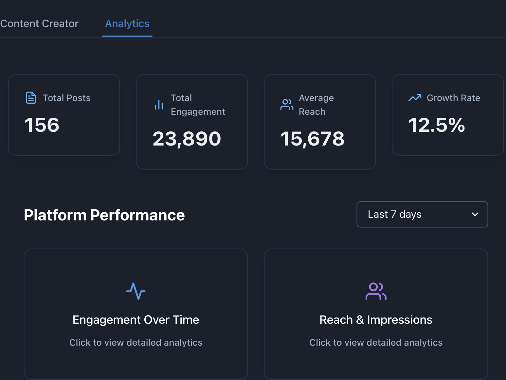
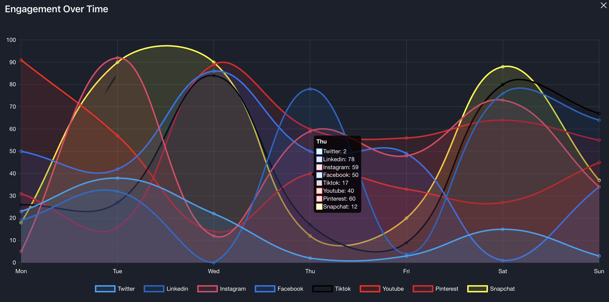

# 🚀 **NimbuzAI - AI-Driven Social Media Content Generator**

<p align="center">
  
</p>


**NimbuzAI** revolutionizes social media management by transforming your ideas into platform-optimized, engaging posts using cutting-edge AI. From analytics to creative content generation, streamline your social media strategy in one place.

---

## ✨ **Features**

### 🎯 **Multi-Platform Support**
- **Twitter/X**: Create concise, engaging tweets with optimal hashtags.
- **LinkedIn**: Craft professional posts with tailored industry insights.
- **Instagram**: Write visually compelling captions with trending hashtags.
- **TikTok**: Develop trendy, viral-friendly content.
- **Facebook**: Generate conversational posts designed for maximum engagement.
- **Snapchat**: Produce youthful, snappy, and creative content.

### 🤖 **AI-Powered Content Transformation**
- **Content Adaptation**: Smart optimization for each platform.
- **Tone Customization**: Choose professional, casual, or trendy styles.
- **Hashtag & Keyword Suggestions**: Enhance discoverability.
- **Character Limit Optimization**: Perfect for every platform.
- **Engagement Optimization**: Maximize reach and visibility.

### 🎤 **Flexible Input Methods**
- **Text Input**: Start with written ideas.
- **Voice-to-Text**: Dictate your thoughts seamlessly.
- **File Uploads**: Transform images, videos, or documents into posts.
- **PDF Extraction**: Extract content from PDFs for posts.

### 📊 **Comprehensive Analytics Dashboard**
- **Post Performance Tracking**: Analyze likes, shares, and comments.
- **Engagement Metrics**: Understand audience behavior.
- **Follower Growth Analysis**: Track progress over time.
- **Platform-Specific Insights**: Get actionable improvement suggestions.

### 🖼️ **AI-Generated Visuals**
- Generate platform-specific visuals using advanced image transformation.
- Optimize images for formats like Instagram stories, TikTok, and more.

---

| Overview | Brainstorm | Generate Image |
|----------|------------|----------------|
|  |  |  |

| Transform | Schedule Post | Reach |
|-----------|---------------|-------|
|  |  |  |

| Analytics | Engagement | Upload |
|-----------|------------|--------|
|  |  |  |

## 🛠️ **Tech Stack**

### **Frontend**
- **Next.js**: Scalable, server-rendered applications.
- **Chakra UI**: Modern, responsive UI designs.
- **TypeScript**: Type-safe, scalable frontend code.
- **React Speech Recognition**: Voice-based input functionality.

### **Backend**
- **Node.js**: High-performance runtime environment.
- **PostgreSQL**: Robust relational database for secure storage.
- **OAuth2**: Secure social media authentication.
- **Google AI (Gemini)**: Advanced content transformation.

---

## 🚀 **Getting Started**

### **Prerequisites**
- **Node.js** (v16+)
- **npm** or **yarn**
- **PostgreSQL**

### **Installation**
1. Clone the repository:
   ```bash
   git clone https://github.com/abhiishek340/NimbuzAi.git
   cd NimbuzAi
   ```
2. Install dependencies:
   ```bash
   npm install
   # Or use yarn
   yarn install
   ```
3. Set up environment variables:
   - Create a `.env` file in the root directory.
   - Add database credentials and API keys.

4. Start the development server:
   ```bash
   npm run dev
   # Or use yarn
   yarn dev
   ```
5. Access the application at `http://localhost:3000`.

---

## 🧪 **Testing**
Run tests to ensure functionality:
```bash
npm test
# Or use yarn
yarn test
```

---

## 💻 **Usage**
1. Log in using OAuth2-enabled social media accounts.
2. Select a platform and input your idea (text, voice, or file).
3. Customize tone, hashtags, and more.
4. Generate and post optimized content directly.
5. Monitor performance through the analytics dashboard.

---

## 🤝 **Contributing**
We welcome contributions! Follow these steps:
1. Fork the repository.
2. Create a new branch:
   ```bash
   git checkout -b feature/YourFeatureName
   ```
3. Commit your changes:
   ```bash
   git commit -m "Add YourFeatureName"
   ```
4. Push your branch:
   ```bash
   git push origin feature/YourFeatureName
   ```
5. Open a pull request.

---

## 📄 **License**
This project is licensed under the MIT License. See the [LICENSE](LICENSE) file for details.

---

## 🌟 **Acknowledgments**
- OpenAI for inspiring AI-driven creativity.
- Google AI (Gemini) for powering advanced content generation.
- The vibrant developer community for open-source tools and libraries.

